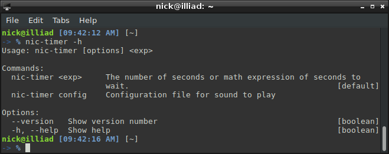
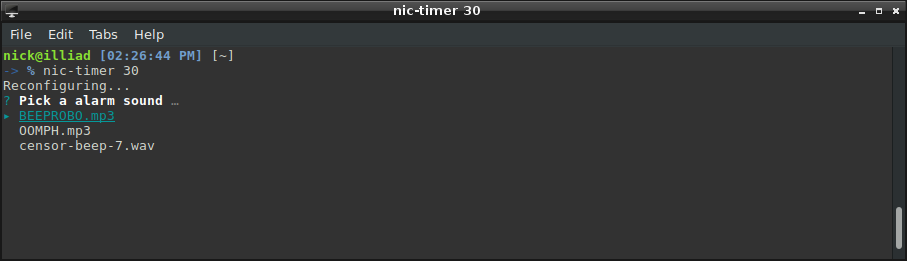
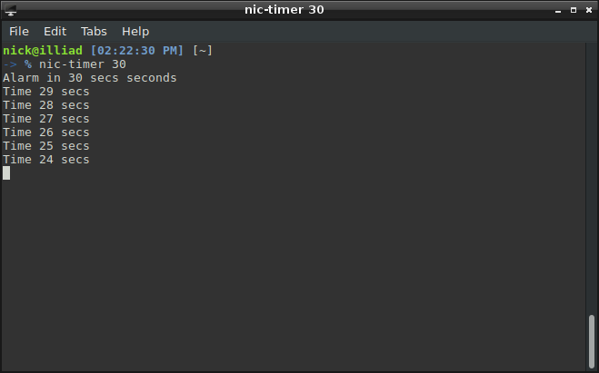

Console Timer
====

Just a simple console timer that will play a sound after the specified number of seconds.

First time setup will ask you to select from a couple default sounds.

This will create a configuration directory at `$HOME/.nic/` the sound file options that 
you get from `nic-timer config` are in `$HOME/.nic/music/` add more for more options.

Contributions welcome as PRs, please follow conventions in the code. Features requests doc updates etc are all welcome.